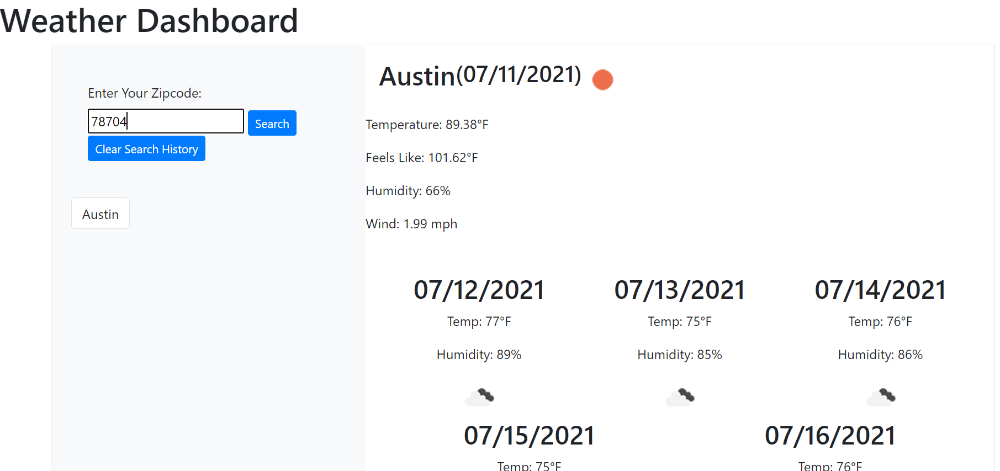

# Weather Dashboard
This application is meant to serve as a simple local weather dashboard in which the user can enter their city in a search-field and a 5-day forecast will be displayed for that city. If the user enters another city, then the previous city will be set aside as a clickable button, using local storage, that they can revisit at any time.

## User Story

```
AS A traveler
I WANT to see the weather outlook for multiple cities
SO THAT I can plan a trip accordingly
```


The following image demonstrates the application functionality:



## Links
- GitHub Repo Link: https://github.com/kjmckinley/weather-dashboard.git
- Deployed Link: https://kjmckinley.github.io/weather-dashboard/

## Contributions
- Kyle McKinley: github - kjmckinley
- Ritchie Ortiz: github - xRortiz91
- github - lacey-griffith, who compelled me to believe that I was approaching this all wrong and needed to start from scratch using a very different approach.
